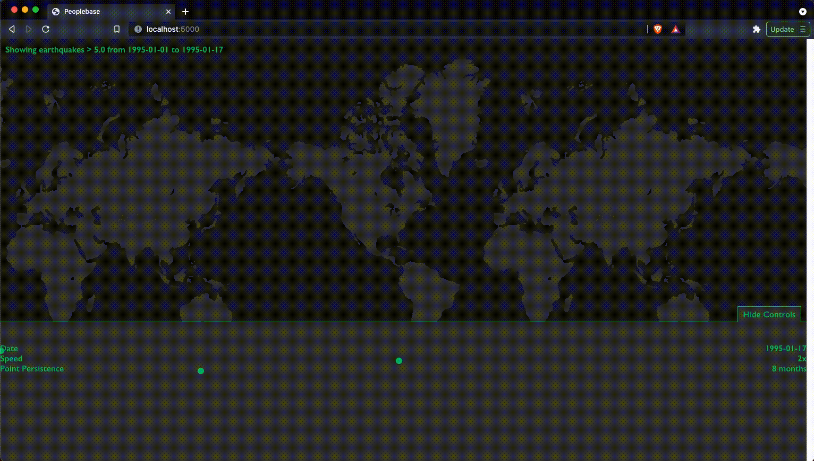

# Ring of Fire

Time-travel visualization of seismic events, using data from USGS.

Very much a WIP, I'm currently trying out a Go backend, and a separate one with Hasura/GraphQL.

{{learning|react|typescript|graphql|go}}